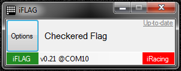

The Software
============

	v0.86 (v0.21)

_iFLAG_ software provides the interconnection of iRacing and the matrix. It continuously listens for iRacing session and other signals, processes them and issues commands telling the device exactly what to display on the LED matrix.

So far _iFLAG_ doesn't come with any installer, it is only an EXE you run. This means that you need to provide certain prerequisities yourself. Namely have this installed on your computer:
- .NET Framework 4 - get it for free from [Microsoft](https://www.microsoft.com/en-us/download/details.aspx?id=17718).
- Arduino IDE (only for drivers) - get it for free from [Arduino](https://www.arduino.cc/en/Main/Software).

__Copy the `software/iFlag` folder to anywhere you like on your harddrive, except Program Files folder(s), and run it from there.__ It is useful to make a shortcut in Startup items to have _iFLAG_ ready as soon as you start the computer.

__Run iFlag.exe and connect the USB hardware__. Order doesn't matter. Read further tho..

First Time Run
--------------

Fresh unprogrammed hardware only blinks and is not discoverable easily by _iFLAG_. However, it will give you its best guess on the actual serial port of the uninitialized hardware. In the options menu, new __"Initialize Board at port..." menu item__ will appear after 30 seconds of fruitless scanning. By using that, the "iFLAG" indicator in the lower left corner will turn blue and your hardware will be flashed with the correct firmware version for the software.

Once the matrix is up to date, the "iFLAG" indicator turns green to indicate the hardware readiness and that you are ready to run.

Program Window
--------------

* __Options__ button lets you specify a few _iFLAG_ settings explained further.
* __"Checkered Flag"__ is the instructional label of the currently shown flag/signal and overlays.
* __iFLAG__ visually indicates USB device connection status, green being connected and red otherwise, with connection details (device firmware version and port) to the right of it
* __iRacing__ visually indicates running iRacing session, green with iRacing launched and red otherwise.

Options
-------

### USB Connector

Since the LED matrix is totally symetrical it allows to be mounted in four different functionally identical orientations with the Arduino's USB connector pointing either __Up__, __Left__, __Right__ or __Down__. Once you choose one of the four options from this option's submenu, a flag will light up momentarily with a letter "F" on it letting you to verify that visuals showed by your device will be correctly upright.

### Flag Modules

The visual features of _iFLAG_ are coupled into modules, which can be turned on and off individually inside this option submenu.

* __Racing Flags__ - currently capable of reacting to iRacing session flag changes and displaying 14 different racing flags. This set is mandatory and can not be turned off.
* __Spotter__ - displays spotter warning of cars next to you. Optional.
* __Start Lights__ - starting procedure lights. Optional.
* __Incidents__ - highlights an incident loss. Optional.
* __Pit Exit Blue__ - shows blue flag on pit exit with faster car within 100 meters behind. Optional.
* __Closed Pits__ - shows signals in case pits are closed. Optional.
* __Pit Speed Limit__ - shows high/low speed signals on pit entry and pit lane. Optional.
* __Repairs Progress__ - shows informational signals about repairs progress. Optional.
* (__Pit Signals__) - coming soon...

### Brightness

_iFLAG_ allows you to set the LED brightness to __Full__, __High__, __Medium__ and __Low__.

### Demo Mode

When not inside iRacing session, _iFLAG_ can either light down and silently wait for the next session or it can cycle through a demo sequence showcasing a subset of its flag signals. As this feature is flashy, you may become annoying, so you can switch it off eventually.

### Always On Top

As usual. Whether to keep the window on top of all other windows.

---
© 2015-2020
[Petr.Vostřel.cz](http://petr.vostrel.cz),
[simracer.cz](http://simracer.cz)

